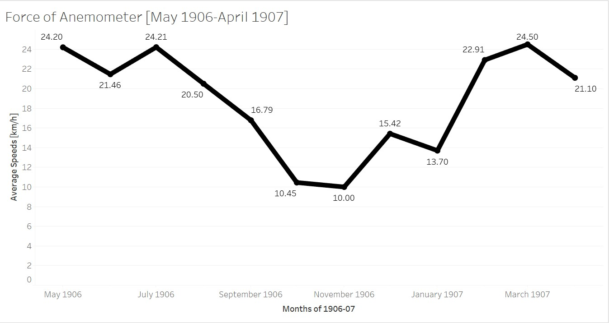

### Introduction

For my subtopic, I've decided to analyze wind speeds in relation to my group's general topic, the Heat of the sun. More specifically, I wanted to pick apart data, like from the Heat of the sun analysis, and get information that can be used to research upon relating to what I've analyzed for the Heat of the sun. I thought this was a good subtopic in that, maybe the two data sets (Wind speeds and the heat of the sun) will conform with one another, or maybe the data is inversely proportional to one in other. With this, it can also question the validity in acquiring this data, through XPath queries. For this, I thought that it would be neat to find a proper credible source that analyzes wind speeds for Alexandria in some arbitrary year, and see if the data trends are the somewhat the same as shown in mine. 

### XPath Query

For my XPath Query, like my general topic, I needed something that yielded results that will tangentially represent what we've researched in our Heat of the sun analysis. XPath Query: `//table//cell[matches(.,'force of anemometer', 'i')]/following-sibling::cell[1]/number()`. This query allowed the search engine to find a table and a cell within the table that has the phrase 'force of anemometer' without case sensitivity and from that pick apart the measure from the Anemometer force cell and yield only the numerical value. The results yielded 215 items, however, I only needed to use the results in my [May 1905-April 1906] timeframe.

### Data Visualization

Now that I've got my results in the allotted time frame, I put the measures with their respective dates in a spreadsheet and converted the data into a visualization through Tableau. Since we are dealing with many different measures I wanted to take the averages of them rather than listing out all the measures in a graph where the visualization would be a bit messy, so I did averages by month. 

Since the XPath query and data for both my subtopic and general topic had the same structure, I wanted to make a contrast in the visualization itself, so I made it a line graph, and I thought it looked nicer and more concise than a bar graph. I believe that even though we are dealing with averages, the visualization is enough to provide a bit of context to what the data may entail and does so without making it look too confusing and messy with data points strewed everywhere.

### What does the visualization show?

In the data visualization, you can notice that an overall trend is shown as the months go by. At the start of the graph, it begins at a high in the Spring months, then decreases down into the colder months then goes back up as Spring season happens again in the following year. From this, we can pick apart some significant meaning as the data somewhat matches up with the data shown in the Heat of the sun research.

### Context

Once my data brought about some potential significant meaning, I wanted to research *why* wind speeds vary throughout the year. On a [science forum](https://www.scienceforums.net/topic/69195-higher-wind-speed-in-winter/), it discusses the science behind why wind speeds are higher in the winter.

> There is much greater variation in barometric pressure during the winter than during the summer. On average, high pressure systems are higher pressure and low pressure systems are lower pressure. This leads to a more rapid flow of air between the systems. This fluctuation is caused by much greater variation in temperature during the winter. While most summer days are roughly the same temperature, winter temperatures fluctuate dramatically.

The science here shows that winter will always have higher wind speeds due to the temperature differences in the season, whereas in the summer there isn't much difference as the temperatures stay hot. Although this source provides a strong foundation on why wind speeds vary throughout the year, I needed to dig deeper. More specifically, I wanted to find a source that showed me the wind speeds in Alexandria itself from a more credible source than what I worked with.

The data visualization shown here provides a good reference to *what* my visualization should represent, as it is a credible source where the data comes from several stations all across Alexandria. From this, it shows that on average the speeds in the colder months are higher than the hotter months, with a big spike in July. 

### Conclusion

So what does my research say about the heat of the sun in relation to wind speeds? Ultimately, not much. In my data, there were some inconsistencies that thrown the visualization off. My data visualization didn't exactly conform to the science behind wind speeds and the bar graph shown above didn't really match up with my visualization. For example, in my data, there were only 2 data points for November and 6 data points for December to work with and both were relatively low which messed with the averages tremendously as these months, being winter months, are supposed to yield higher averages. These holes and inconsistencies in the data points themselves made the visualization inaccurate, and there really wasn't much I could do about it. In general, there is a relationship between the heat of the sun and wind speeds, as summer months yield lower wind speeds and winter months yield higher wind speeds. This is what my data should have supported, however, with the lack of data in my timeframe in specific months I was unable to do so.