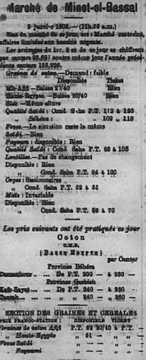
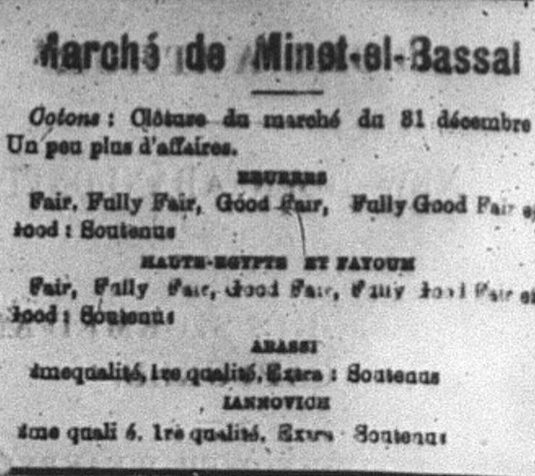
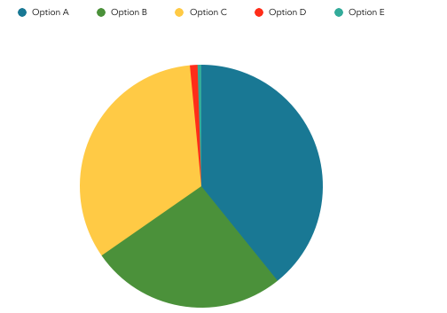
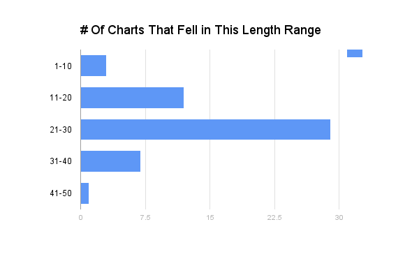

{\rtf1\ansi\ansicpg1252\cocoartf1404\cocoasubrtf470
{\fonttbl\f0\fswiss\fcharset0 ArialMT;\f1\froman\fcharset0 Times-Roman;\f2\fnil\fcharset0 AvenirNext-Regular;
}
{\colortbl;\red255\green255\blue255;\red0\green0\blue0;}
\margl1440\margr1440\vieww10800\viewh8400\viewkind0
\deftab720
\pard\pardeftab720\fi720\sl380\sa293\partightenfactor0

\f0\fs28 \cf2 \expnd0\expndtw0\kerning0
\outl0\strokewidth0 \strokec2 #Egyptian Gazette
\f1\fs24 \

\f0\fs28 ##Changes Over the Year
\f1\fs24 \
\pard\pardeftab720\sl320\partightenfactor0
\cf2 \
\pard\pardeftab720\fi720\sl380\sa293\partightenfactor0

\f0\fs28 \cf2 ###Different Pages
\f1\fs24 \

\f0\fs28 While working on assignments for this class, I quickly realized that the formatting of my issue was very different from the rest. Many of my advertisements were different, the financial tables were all ordered in a weird way, and my Wednesday issue only contained six pages instead of eight. This caused many problems for me because I would have to make all of the tables myself, which was very time consuming and confusing because I had no idea how to do any of it. Particularly, the tables for Marche de Minet-el-Bassal were very different. The first change I encountered with this table was actually in my own week. I first saw the table on page two of my first day, January second, then noticed that on January third the table began appearing on page 4. After looking through images of the other issues, I noticed the table then remained on page four. I also quickly noticed that issues containing eight pages would display these data tables on page six, and many issues in December contained eight pages throughout the week, not just the usual Wednesday and Saturday issues. So, I am left curious as to why it was on page two of the first issue of the year. Maybe there was a mistake made or something of the sort but the reasoning is lost in history. 
\f1\fs24 \

\f0\fs28 ###Format Changing
\f1\fs24 \

\f0\fs28 The next thing I noticed was how the format of the table changed. I was super confused when I looked at how different my first Marche de Minet-el-Bassal was from the template posted. Mine was so much smaller and shorter than the template, I thought I was missing information and spent a good bit of time scanning the page for the rest of it. Thankfully, for me, this difference saved me time due to how much smaller it was. To gather data for this, I individually looked through each image file posted on the group github because I knew that not many people would have filled out the chart and wanted to try to get accurate data. While looking through the page images of the whole newspaper, I continued to notice small differences between the table in different issues. Most of the differences occurred between the sections titled \'93disponsible\'94 and \'93section des graines et cereales.\'94 One of my pages from January had a section called \'93coton\'94 in between, an issue from April had one named \'93oignons,\'94 while another issue from July had no extra section. To gather data for this particular table, I searched through all of the uploaded files. I did this research between over the course of two days, November thirtieth and December first, so the data only includes pages uploaded between those days. I did a query of the title of the table, which yielded a total of one hundred and eighty one files. I found that there were a total of five different formats of the table. I then continued to count how many times each particular format was used. I tried to find a distinct trend as to when certain formats were used. The only thing that I did notice was that the bulk of Option A occurred towards the beginning of the year, and Option B was dispersed mostly in the spring/summer months, and Option C was mostly found starting in the end of summer throughout the winter. I am not sure why this would occur but it did. Options D and E were completely random and I was very confused as to why those formats were used. I thought maybe on those particular days there was no information or data to be recorded, but if that is the reason, why would they include the section at all? I thought this to be very weird. To look further into this change, I ran a second search through the pages to look into the number of \'93p\'94 tags under the title of \'93MARCHE DE MINET ET BASSAL.\'94 From this, I took the data from the search to make a chart to compare the varying lengths of this table throughout the year. For the graph, I made the first group of data start from one instead of zero because while many people had the title of the chart in their xml, they had zero p tags because they did not fill out the chart and I did not want to include this in my final analysis. With this search, I was looking to find the average length of the chart, so the charts that were not completed did not contribute to my analysis. Out of the one hundred and sixty three results that came up from the search, only fifty two contained p tags. I was able to identify the average range of p tags for the Marche de Minet et Bassal table fell between twenty one and thirty. This could be due to the different formats I had already discovered throughout the newspaper. I would postulate that this variance could be due to how each student set up their own table in xml, however we were all provided with the same template so I do not think that hypothesis is a strong contender. Therefore, I think it is safe to assume this difference truly is due to different formats for this table. This extra search proved to be very interesting and useful to show how different the formats of the table are due to the fact that the tables range in p tag lengths so much, the lowest being at ten and the highest being at forty two.
\f1\fs24 \
\pard\pardeftab720\sl380\sa293\partightenfactor0

\f0\fs28 \cf2 ### Other Changes
\f1\fs24 \
\pard\pardeftab720\fi720\sl380\sa293\partightenfactor0

\f0\fs28 \cf2 Of course, this was not the only difference I observed while completing work for this class. As previously mentioned, my pages contained many ads that were not in the database of templates. In fact, I had to make most of my advertisements myself. Some examples of ads include Grand Hotel Helouan, Pagnon\'92s Hotel, Grand Hotel Khartoum, and Apollinaris. My Sunlight Soap ads were also in a different format. This was a challenge for me because I did not know how to make my own ads or what format to use, so I kinda just typed random things and hoped that they would work out. This was very time consuming for me, but thankfully I figured out how to do it on my own. Another thing that varied for me was the Daily Weather report. Some of my tables would not include foreign stations or phases of the moon. This confused me because I figured since this data was actually useful to the everyday person, the format would be consistent. However, this was not the case and I am left curious as to the reason. Many of the tables on my pages fours were also very different from the templates. For future research on this topic, someone could look into the differences on these tables. Some of these tables were missing rows for me or had additional ones, specifically the London Stock Exchange. My London Stock Exchange was missing six rows, compared to the template provided on the gitbhub website. If someone wanted to, it would be interesting to look into why these changes occur, if they have specific reasons related to the data findings for the day or if the changes are related to the month or the season. Another thing that was completely different for me was the Peninsular & Oriental S.N. Company chart that appeared on page one. Mine had a detailed of chart that included each ship name, the date it was leaving, the destinations of each ship as well as a number that I was not sure what represented. This stood out to me because most of the other format changes I noticed were mostly tables having less information or more information, not a completely different format for the same company. My papers also included information for a different shipping line called White Star Line. I am curious as to why this shipping line only appears in the beginning of the year and not the rest. Did it go out of business or does it only run in the winter? Questions like these are ones that could be answered by further research on format changes that occur in the newspaper. Another change I found peculiar was the prevalence of eight page issues in December, as previously mentioned. For each week, two issues typically contained seven or eight pages. Towards the end of the year I noticed a trend over the last few weeks in which every single issue contained eight pages instead of six. This format change is very interesting because why would they extend the length of the paper everyday? There are numerous changes that could be studied. Some are less noticeable than others but still leave me curious. While I could easily observe and record the data for the differences in Marche de Minet-el-Bassal, I am left unable to explain why these differences occur. It could be possible that certain formats were used depending on what data was gathered and recorded for those days. It is not clear why this change occurred, but it is one that was very prevalent throughout the year.
\f1\fs24 \
\pard\pardeftab720\fi720\sl380\sa293\partightenfactor0

\f0\fs28 \cf0 \outl0\strokewidth0 \
\
\
\
\
\
\
\

\f1\fs24 \
\pard\pardeftab720\sl320\partightenfactor0
\cf0 \
\pard\tx560\tx1120\tx1680\tx2240\tx2800\tx3360\tx3920\tx4480\tx5040\tx5600\tx6160\tx6720\pardeftab720\fi720\sl264\slmult1\sa280\partightenfactor0

\f2\fs28 \cf0 \
}